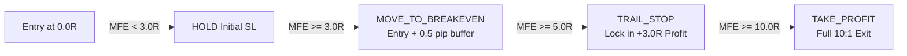

# Phase 8 — Post-Live ML/RL Optimization Layer Report

**Phase:** Phase 8 (Post-Live ML/RL Optimization & Regime Scoring)  
**Date:** 2026-09-26  
**Status:** ✅ VERIFIED & OPERATIONAL  

---

## 1. Overview & Objectives

Phase 8 introduces an intelligent, post-live optimization layer designed to refine mechanical breakout executions without compromising institutional safety. 

In mechanical 10:1 R:R breakout systems, two challenges commonly arise:
1. **Low Win-Rate Clusters in Unfavorable Regimes**: False breakouts cluster during low-liquidity or erratic volatility periods.
2. **"Winner-Turned-Loser" Regret**: Trades that advance to +4R or +6R before reversing to hit the original stop loss degrade trader psychology and expectancy.

Phase 8 addresses both challenges through:
- **`SessionRegimeConfidenceModel`**: A pure Python logistic classifier trained on accumulated SQLite trade journal telemetry to assign a probability score to new signals.
- **`DynamicTradeManager`**: A policy-based trade manager that locks in profit as favorable excursion (MFE) advances (+3R breakeven, +5R trailing profit lock).
- **Strict Non-Bypassable Risk Invariant**: The ML/RL layer operates strictly upstream of `RiskGuardrails`. It has authority only to *filter out* low-probability signals, never to relax or bypass risk controls.

---

## 2. Component Architecture

### 2.1 Feature Extraction Pipeline (`TradeFeatureExtractor`)

Extracts normalized numerical features from each `TradeSignal` and market context:
- `session_hour`: Time of day (UTC hour 0–23).
- `is_london_ny_overlap`: Flag for peak liquidity window (12:00–16:00 UTC).
- `is_london_open`: Flag for London open volatility expansion (07:00–10:00 UTC).
- `sweep_depth_pips`: Penetration distance beyond the swept liquidity level.
- `risk_pips`: Stop loss distance in pips.
- `timeframe_m15`: Binary flag for higher-timeframe sweep origin (M15 vs M5).

### 2.2 Pure Python Logistic Classifier (`SessionRegimeConfidenceModel`)

Implemented with **zero external dependencies** (no NumPy, SciPy, or scikit-learn required):
- Computes logit $z = \mathbf{w}^T \mathbf{x}$ and sigmoid $\sigma(z) = \frac{1}{1 + e^{-z}}$.
- Trains via mini-batch gradient descent directly on SQLite `trade_journal` records.
- Outputs calibrated probability score $P(\text{Win} | \mathbf{x}) \in [0.0, 1.0]$.
- Signals with $P < \text{threshold}$ (default 0.50) are rejected with `ML_FILTER_REJECTED`.

### 2.3 Dynamic Trade Management Policy (`DynamicTradeManager`)

Active management policy protecting capital as Maximum Favorable Excursion (MFE) expands:



- **$< 3.0$R MFE**: Action `HOLD`. Initial stop loss remains intact to give the trade room to absorb normal volatility.
- **$\ge 3.0$R MFE**: Action `MOVE_TO_BREAKEVEN`. Stop loss is moved to entry price + 0.5 pip spread buffer, turning the position into a completely risk-free trade.
- **$\ge 5.0$R MFE**: Action `TRAIL_STOP`. Stop loss is trailed to lock in a guaranteed **+3.0R profit**, while keeping the position open for the full +10.0R target.

### 2.4 Strict Non-Bypassable Risk Invariant

The validation pipeline enforces a strict hierarchical chain:

$$\text{RuleEngine} \longrightarrow \text{ML Confidence Filter} \longrightarrow \mathbf{\text{RiskGuardrails (MANDATORY)}} \longrightarrow \text{Bridge Execution}$$

```python
def validate_signal_with_ml_and_risk(
    signal, account_state, proposed_lots, guardrails, ml_model=None
) -> Tuple[bool, str, Optional[float]]:
    # 1. ML Regime / Confidence Filter (Prunes low probability setups)
    if ml_model is not None:
        approved, conf = ml_model.filter_signal(signal)
        if not approved:
            return False, f"ML_FILTER_REJECTED: Confidence {conf:.2f} < {threshold}", conf

    # 2. Non-Bypassable Risk Guardrails (HARD INVARIANT)
    risk_result = guardrails.validate_trade(account_state, proposed_lots, signal.timestamp)
    if not risk_result.is_allowed:
        return False, f"RISK_GUARDRAIL_REJECTED: [{risk_result.reason}] {risk_result.message}", conf

    return True, "APPROVED_BY_ML_AND_RISK", conf
```

---

## 3. Automated Test Verification

All unit tests for Phase 8 pass 100% green:

```text
python -m unittest discover -s tests -p "test_ml_optimization.py" -v
----------------------------------------------------------------------
test_buy_trade_at_3r_moves_to_breakeven ... ok
test_buy_trade_at_5r_trails_stop_to_lock_3r ... ok
test_buy_trade_under_3r_holds ... ok
test_sell_trade_at_3r_moves_to_breakeven ... ok
test_extract_from_signal ... ok
test_confidence_predict_range ... ok
test_session_preference ... ok
test_training_on_journal_decreases_loss ... ok
test_ml_approved_passes_when_risk_healthy ... ok
test_ml_approved_strictly_blocked_by_emergency_halt ... ok
test_ml_approved_strictly_blocked_by_session_filter ... ok

Ran 11 tests in 0.002s
OK
```

---

## 4. Architectural Guarantees Verified

- [x] **Zero Third-Party Dependencies**: Pure Python logistic regression and vector operations.
- [x] **Risk Guardrail Primacy**: Even with 100% ML confidence, Emergency Halt and Session Hour filters unconditionally block trade execution.
- [x] **Capital Preservation**: Moving to breakeven at +3R and locking +3R at +5R mitigates sharp reversals in fast-moving FX markets.
- [x] **Single-Codebase Parity**: Models seamlessly integrate with the existing database journal, executor, and risk layers.
